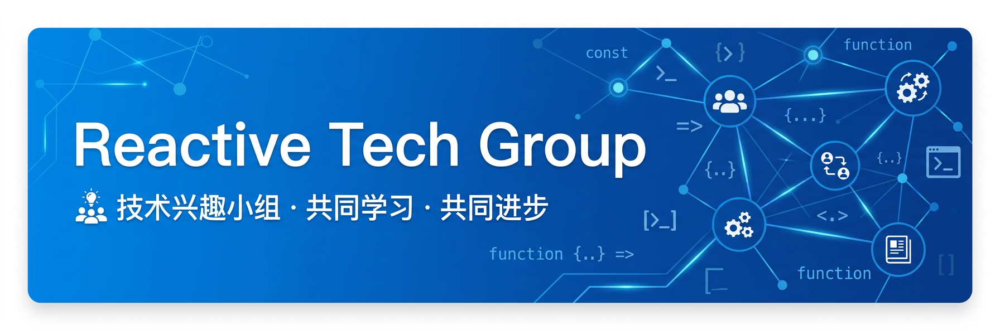
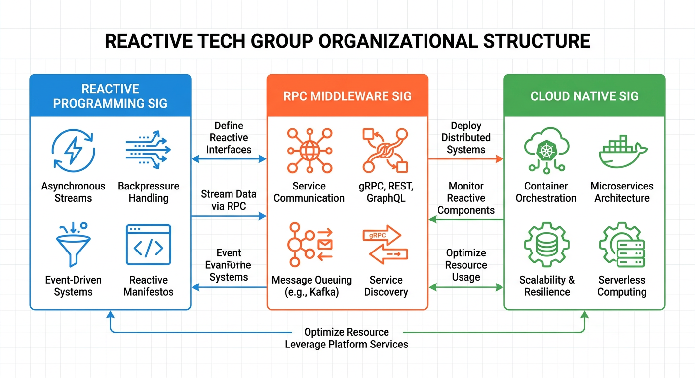
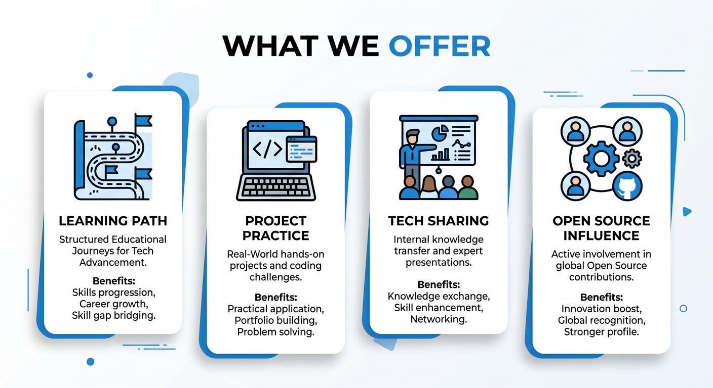

  

<h1 align="center">Reactive Tech Group</h1>

  <strong>技术兴趣小组 · 共同学习 · 共同进步</strong>

  
  

---

## 📖 简介

**Reactive技术兴趣小组**是一个面向技术爱好者的学习社区，致力于通过共同学习和项目实践来提升成员的技术水平。

> 为什么叫"Reactive"？因为最初小组成员主要研究**反应式编程**相关技术，后来拓展到多个技术领域，但名字保留了最初的"Reactive"。

### 我们的初衷

聚集对技术有热情的同学，**共同学习、共同进步**，提升小组成员的技术水平和在公司/社区中的技术影响力。

通过小组成员的合作，完成具有挑战性的技术项目，让所学有所实践。

---

## 🏗️ 组织架构

  

### 三大技术路线

| SIG | 技术领域 | 核心内容 |
|-----|---------|---------|
| **反应式编程SIG** | Reactive Programming | WebFlux、Vert.x、RSocket、异步非阻塞编程 |
| **RPC中间件SIG** | RPC Middleware | Dubbo、gRPC、Service Mesh、网络协议 |
| **云原生中间件SIG** | Cloud Native | Kubernetes、Dapr、Serverless、微服务架构 |

---

## ✨ 我们提供什么

  

### 1. 清晰的技术发展路线

针对每个成员的自身技术能力和兴趣方向，提供清晰深入的技术发展路线：

- **反应式编程路线**: 异步非阻塞 → WebFlux/Vert.x → RSocket/gRPC → 参与框架开发
- **RPC中间件路线**: RPC基础 → 网络协议 → Dubbo核心 → 云原生改造
- **云原生路线**: K8s基础 → Service Mesh → Serverless → 云组件开发

### 2. 技术项目实践

小组成员合作实践能够运用先进技术的技术性项目：

- 高性能应用框架开发
- 中间件云原生改造
- 开源社区贡献项目

### 3. 定期技术分享

以团队的力量更快地学习你想掌握的知识：

- 内部技术分享会
- 技术文章输出
- Meetup活动参与

### 4. 开源影响力建设

深入参与开源社区建设，在开源社区建立技术影响力：

- 参与Apache/Dubbo等顶级项目
- 技术博客和公众号文章
- 技术大会演讲机会

---

## 🚀 如何加入

### 我们在寻找什么样的成员？

我们希望找到的是：**对技术有追求、能够一同进步的同行者**，而不是只来索取而不付出的"技术白嫖客"。

### 加入条件（满足其一即可）

#### 方案A：开源贡献者通道
- 为 **star > 4000** 的开源项目提交过至少一次被接纳的PR
- 基本不用再考核你的技术热情，直接欢迎加入

#### 方案B：预备成员通道
- 对技术有热情，愿意花费时间参与技术学习和贡献
- 成为预备成员 → 帮助你成为开源贡献者 → 正式加入

> 💡 **提示**: 在预备期间，可能会分配相关技术项目的工作内容，并提供帮助和指导。如果顺利完成，基本可以通过考核。

### 加入流程

1. 📖 阅读 [新人报名必读](./guide/newcomers_guide.md)
2. 📝 了解 [SIG小组划分](./SIG_GROUP.md)
3. 📋 按照 [SIG报名指南](./guide/sign_up_guide.md) 提交申请
4. 💬 参与讨论和考核
5. 🎉 正式成为小组成员

---

## 📚 核心资源

### 1. 小组介绍
- [Reactive技术兴趣小组简介](./INTRODUCTION.md)
- [合作模式说明](./COOPERATION.md)

### 2. SIG技术路线
- [反应式编程SIG](./SIG_GROUP.md#反应式编程sig)
- [RPC中间件SIG](./SIG_GROUP.md#rpc中间件sig)
- [云原生中间件SIG](./SIG_GROUP.md#云原生中间件sig)

### 3. 成员与报名
- [成员介绍](./MEMBER.md)
- [SIG报名](./SIGN_UP_SIG.md)
- [新人报名必读](./guide/newcomers_guide.md)
- [报名指南](./guide/sign_up_guide.md)

### 4. 工作与交流
- [SIG工作库](https://github.com/reactivegroup/sigs)
- [Meetup资料](https://github.com/reactivegroup/reactive-meetup)
- [贡献指南](./CONTRIBUTING.md)

---

## 📝 已发表文章

### 反应式编程SIG
- [Reactive模式在Trip.com消息推送平台上的实践](https://mp.weixin.qq.com/s/gQYZGQVwqWF3LOH51JAOwg)

### RPC中间件SIG
- [深入解析Dubbo3.0服务端暴露全流程](https://mp.weixin.qq.com/s/nEhvPl7IWlQU2VfpXwZtOw)

---

## 🎯 你将收获什么

1. **清晰的职业发展路线** - 对自己的技术发展路线有清晰的认知，规划未来职业发展
2. **前沿技术感知** - 对业界和开源社区前沿技术有敏锐感知，成为技术趋势先锋
3. **开源影响力** - 深入参与开源社区建设，建立个人技术品牌
4. **技术项目经验** - 参与大型技术项目，突破业务项目瓶颈，书写富有挑战的代码

---

## 🤝 贡献指南

我们欢迎各种形式的贡献：

- 📖 技术文档和教程
- 💻 代码和项目贡献
- 🎤 技术分享和演讲
- 🐛 Bug报告和修复
- 💡 新功能建议

详见 [如何贡献](./CONTRIBUTING.md)

---

## 📜 许可证

本项目采用 Apache License 2.0 许可证 - 详见 [LICENSE](LICENSE) 文件

---

  <strong>让我们一起，共同学习，共同进步！</strong>

  <a href="https://groups.google.com/g/reactive-group">Google Group</a> ·
  <a href="https://github.com/reactivegroup">GitHub</a>

